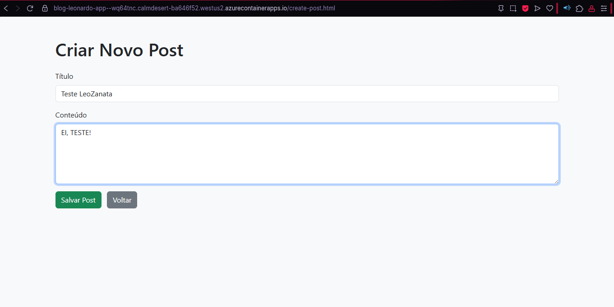
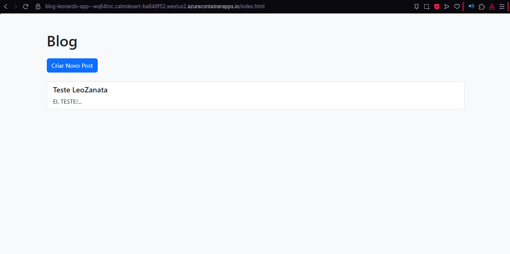
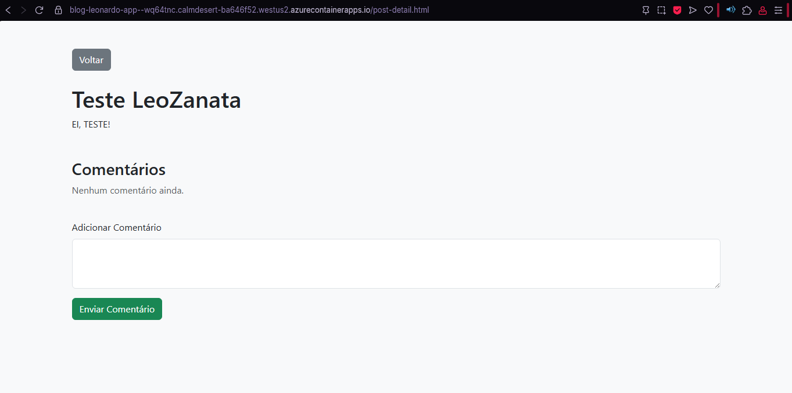
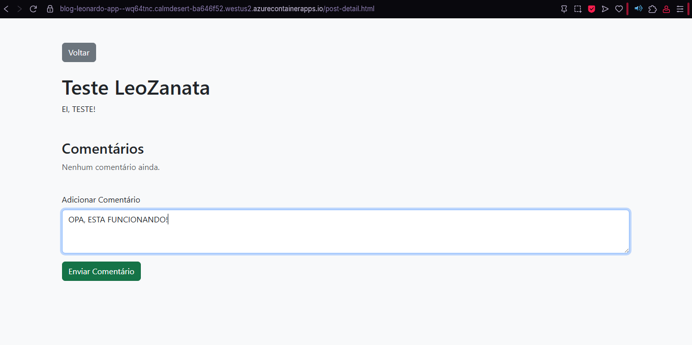
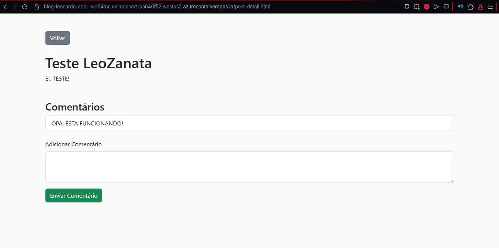

# Projeto Blog/E-commerce com Azure Container Apps e Persistência de Dados na Cloud

Este repositório contém um projeto prático que demonstra a modernização de uma aplicação web de blog (simulando um e-commerce em termos de persistência de dados) utilizando **Azure Container Apps** para hospedagem de microsserviços conteinerizados e um serviço de banco de dados Azure para **persistência de dados na Cloud**.

O projeto evolui de um frontend estático que gerencia posts e comentários via `localStorage` para uma arquitetura que incorpora um **backend dedicado** para a manipulação e armazenamento de dados em um banco de dados Azure.

**Recursos e Tecnologias Utilizadas:**

* **Azure Container Apps (ACA):** Para hospedar microsserviços e o frontend conteinerizados.
* **Azure Container Registry (ACR):** Para armazenar e gerenciar as imagens Docker do projeto.
* **Azure CLI:** Para provisionamento e gerenciamento de recursos na linha de comando.
* **Docker:** Para conteinerização da aplicação.
* **HTML, CSS (Bootstrap), JavaScript:** Para o desenvolvimento do frontend.
* **PowerShell Script (.ps1):** Para automatizar o processo de build, push e implantação no Azure.

**Principais Aprendizados e Insights:**

* **Conteinerização de Aplicações:** Experiência prática em empacotar uma aplicação web e seu backend em imagens Docker.
* **Microsserviços com Azure Container Apps:** Demonstração de como o ACA simplifica a implantação e o gerenciamento de múltiplos contêineres (frontend e backend) em um ambiente serverless.
* **Persistência de Dados na Nuvem:** Migração da persistência de dados do `localStorage` do navegador para um banco de dados gerenciado no Azure, evidenciando a robustez e escalabilidade da nuvem.
* **Gerenciamento de Quotas no Azure:** Enfrentamento e resolução de desafios comuns como o limite de um Ambiente de Aplicativo de Contêiner por assinatura (seja regional ou global), ressaltando a importância de entender as quotas de serviço.
* **Autenticação no Azure Container Registry:** Superação de problemas de login no ACR, aprendendo sobre a necessidade de habilitar o usuário administrador para acesso via credenciais diretas.
* **Automação com Azure CLI:** Utilização de scripts para automatizar todo o ciclo de provisionamento e implantação de infraestrutura e aplicação.

**Como Rodar o Projeto (Localmente e no Azure):**

* **Localmente:** Basta abrir os arquivos HTML no navegador.
* **No Azure:** Siga os passos no `scripts.ps1` para construir as imagens Docker, enviá-las para o ACR e implantar os Container Apps no Azure.

**Próximos Passos e Possíveis Melhorias:**

* Implementação de autenticação e autorização de usuários.
* Adição de funcionalidades completas de e-commerce (carrinho de compras, catálogo de produtos).
* Integração com Azure Monitor para telemetria e observabilidade aprofundadas.
* Configuração de CI/CD pipelines (GitHub Actions/Azure DevOps) para automação contínua de build e deploy.
* Configuração de domínios personalizados e certificados SSL.

---

**Explicação dos pontos adicionados:**

* **Foco no "E-commerce":** Embora seu projeto seja um blog, a descrição o conecta ao tema "Armazenando dados de um E-Commerce na Cloud" focando na persistência de dados.
* **Destaque para ACA:** Enfatiza o uso do Azure Container Apps como tecnologia central.
* **Aprendizados Específicos:** Menciona os desafios reais que você superou (limite de ambientes, login no ACR), o que é muito valioso para um recrutador.
* **Estrutura Clara:** Divide em seções lógicas para facilitar a leitura e compreensão.
* **Próximos Passos:** Mostra que você pensa além do projeto atual e tem planos para futuras melhorias.

##  Screenshots

### Tela de Criação de Post

### Tela Inicial

### Tela de Vizualização de Post

### Tela de Adição de Comentário

### Tela de Vizualização de Comentário

## 🤝 Contribuição

Contribuições são bem-vindas! Se você tiver sugestões ou melhorias, sinta-se à vontade para abrir uma issue ou enviar um pull request.

## 📄 Licença

Este projeto está sob a licença MIT. Veja o arquivo [LICENSE](LICENSE) para mais detalhes.
